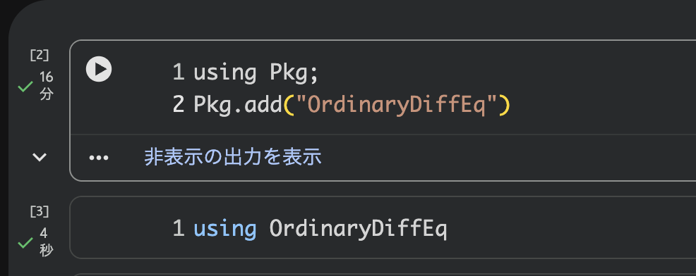
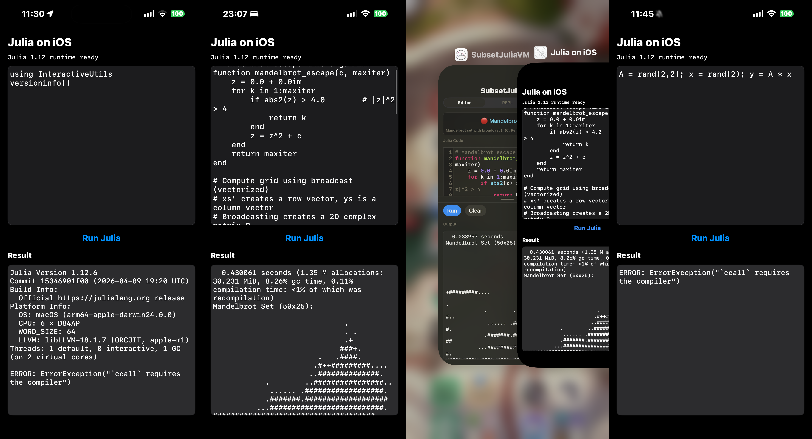
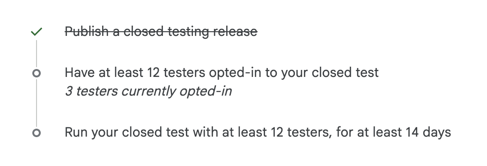

---
format:
  revealjs:
    theme: dark
    slide-number: true
    preview-links: auto
    css: assets/slide-executor.css
    include-after-body: assets/after-body.html
---

## Let’s run Julia everywhere from mobile to web

- [Link to slide](https://atelierarith.github.io/AtelierArith_JuliaCon2026_talk/) ↓↓↓

{width="320"}

## What I created

- **SubsetJuliaVM** — a stack-based VM for a subset of Julia
  - Looks like Julia and walks like Python
  - CLI binary name: `sjulia` (think "subset Julia")
  - Implemented in Rust
- Runs on iOS and Android devices
  - The VM compiles to WebAssembly, so it also runs in the browser
- Supports parts of Plots.jl, OrdinaryDiffEq.jl, Symbolics.jl, AbstractAlgebra.jl, and more

## Deliverables {.smaller}

**iOS / iPadOS** — a native app with no JIT, fully App Store compliant

::: {.columns}
::: {.column width="33%"}
**iOS app**<br>[App Store](https://apps.apple.com/us/app/subsetjuliavm/id6757257182)

{width="240"}
:::
::: {.column width="33%"}
**Source code**<br>[julia-vm-oss](https://github.com/AtelierArith/julia-vm-oss)

{width="240"}
:::
::: {.column width="33%"}
**Web playground**<br>[subset_julia](https://terasakisatoshi.github.io/subset_julia/)

{width="240"}
:::
:::

### Google it `SubsetJuliaVM`

---

## Live demo (inside these slides)

- Seeing is believing
- The next slides embed **the very same WASM VM**.

Edit the code and run it with **Ctrl+Enter** / **⌘+Enter** (or **Run**). Press **Clear** to clear the output.

::: {.notes}
The demo is the heart of this talk. Keep the explanation short and run the code.
:::

## Hello, SubsetJuliaVM

```{=html}
<div class="sjulia-executor" data-code="println(&quot;Hello from WebAssembly!&quot;)\nprintln(1 + 2 * 3)"></div>
```

---

## Why I created it

- I loved Pythonista (iOS app)
- I wanted to run Julia on my iPad — **offline**

---

## What about Binder or Google Colab?
  - Unusable where the internet connection is unreliable
  - Installing external packages takes a long time



---

## Can we run official Julia on iOS? (1/3)

- It's difficult to run the original functionality as-is.
- Official Julia relies on **JIT compilation**
- Ordinary iOS apps cannot freely generate and execute native code at runtime
  ([W^X](https://support.apple.com/guide/security/security-of-runtime-process-sec15bfe098e/web))
- App Store rules also restrict downloaded code that changes app functionality
  ([Review Guidelines §2.5.2](https://developer.apple.com/app-store/review/guidelines/#2.5.2))
- SubsetJuliaVM uses a **bundled interpreter** instead:
  bytecode stays data, and the signed app interprets it

---

## Can we run official Julia on iOS? (2/3) {.smaller}

**Experimentally, yes — but this is not an official iOS port.**

::: {.columns}
::: {.column width="48%"}
Verified with **Julia 1.12.6** on a physical iPhone 15 Pro Max:

```julia
println("Hello World")
using InteractiveUtils
versioninfo()
A = rand(2, 2)
x = rand(2)
y = A * x # <- does not work
```

- Bundle the official macOS arm64 runtime and sysimage
- Rewrite Mach-O platform metadata and sign every dylib
- Run with `--compile=no` and small compatibility shims
:::

::: {.column width="52%"}
**Major limitations**

- No JIT: only interpreter-compatible or already compiled paths work
- `InteractiveUtils` is reduced to the non-verbose `versioninfo()` path
- Most standard libraries, packages, and JLLs are unsupported
- BLAS-backed matrix operations still fail with `` `ccall` requires the compiler ``
- Development-signed research prototype; not App Store-ready
:::
:::

---

## Can we run official Julia on iOS? (3/3) {.smaller}



---

## How I created SubsetJuliaVM

- Apps like Pythonista and Carnets do run on iOS.
  - So why not build a virtual machine that accepts Julia syntax?!
- I don't have the ability to create this 😭
  - Let's use AI 🤖
  - Built with heavy use of AI tools: Claude Code, Codex, Cursor, DeepSeek, Kimi, etc.

## Let's actually build it!
  - A stack-based bytecode interpreter (**no JIT**)

```{=html}
<div class="pipeline">
  <div class="pipeline-node">Julia source</div>
  <div class="pipeline-arrow">→</div>
  <div class="pipeline-node">parse → CST</div>
  <div class="pipeline-arrow">→</div>
  <div class="pipeline-node">lower → Core IR</div>
  <div class="pipeline-arrow">→</div>
  <div class="pipeline-node">compile → bytecode</div>
  <div class="pipeline-arrow">→</div>
  <div class="pipeline-node">stack VM → result</div>
</div>
```

Result: [AtelierArith/julia-vm-oss](https://github.com/AtelierArith/julia-vm-oss)

```sh
$ git clone https://github.com/AtelierArith/julia-vm-oss.git
$ cd julia-vm-oss
$ ./scripts/sjulia_install.sh   # Windows: pwsh -File scripts/sjulia_install.ps1
$ sjulia examples/mandelbrot.jl
  0.027875 seconds
Mandelbrot Set (50x25):

                              .
                              . .
                              .+
                             ###+.
                        .   .####.
                       .#++#########....
                      ..##############.
            .        ..################..
             ...... .##################.
            .#######.###################
          ...##########################.
#####################################..
          ...##########################.
            .#######.###################
             ...... .##################.
            .        ..################..
                      ..##############.
                       .#++#########....
                        .   .####.
                             ###+.
                              .+
                              . .
                              .

```

---

## How SubsetJuliaVM differs from official Julia {.smaller}

How code is interpreted and executed:

Each cell: *who does it* → *what it produces*

| Stage | Official Julia | SubsetJuliaVM |
|------|-----------|---------------|
| Parsing | flisp / JuliaSyntax.jl → AST | pure-Rust parser → CST |
| Lowering | Julia's lowering → lowered IR | Rust lowering → Core IR |
| Code generation | LLVM **JIT at runtime** → native code | bytecode compiler **before execution** → bytecode |
| Execution | CPU runs native code | stack VM interprets bytecode |
| Runtime library | C runtime + pure-Julia `base/` | Rust builtins + a pure-Julia subset |

- With no JIT, SubsetJuliaVM **runs even on iOS (W^X) and WASM**

## What SubsetJuliaVM does *not* provide {.smaller}

Everything that would break the sandboxed, offline, no-downloaded-code model:

- **Pkg.jl / package management** — no `Pkg.add`, no registry, no downloads;
  `using X` only reaches the ~34 packages bundled into the binary
- **Network I/O** — no Sockets, no Downloads/HTTP
- **Filesystem access** — file operations are unimplemented;
  `include` resolves through virtual embedded paths
- **External processes** — no `run(cmd)`
- **C interface** — no `@ccall`/`pointer`/`unsafe_*`
- **Real parallelism** — single-threaded by design;
  Tasks/Channels are cooperative continuations
- `@generated` macro
- **Native-code reflection** — no `@code_llvm`/`@code_native` (there is no LLVM);
  use `sjulia --dump-bytecode` instead
More details: see the [Appendix slides](appendix.html)

---

## What we support {.smaller}

- Basic Julia syntax (subset)
- ~34 bundled 3rd-party packages (no download), including:
  - **Plots**, StatsPlots, JSXGraph, Interact
  - **OrdinaryDiffEq**, SciMLBase
  - **Symbolics**, AbstractAlgebra, Primes, Combinatorics
  - **Distributions**, StatsBase, Optim, QuadGK, HCubature
  - StaticArrays, SparseArrays, SpecialFunctions, Quaternions, Rotations, …
- These have been re-implemented specifically for SubsetJuliaVM.

---

## `juliars` {.smaller}

An **experimental Julia → Rust AoT transpiler** (same frontend as the VM).

- Pipeline: source → CST → Core IR → **Rust source** → `rustc -O` → native binary
- Unlike JuliaC / PackageCompiler, it does **not** need `libjulia`
- Best for scalar numerics, loops, arrays — the broad package surface stays on the **VM**
- On the coprime-π / Mandelbrot benches: **about as fast as official Julia**

```sh
$ cargo build --release -p subset_julia_vm --features aot --bin juliars
$ target/release/juliars --minimal-prelude examples/mandelbrot.jl --emit-binary target/mandelbrot_aot
$ target/release/mandelbrot_aot
```

## Performance: Julia vs. SubsetJuliaVM {.smaller}

Coprime-π benchmark — $P(\gcd(a,b)=1)=6/\pi^2$ (Apple Silicon macOS):

::: {.columns}
::: {.column width="55%"}
```julia
# P(gcd(a,b)=1) = 6/π²  →  π = √(6/P)
function mygcd(a, b)
    while b != 0
        tmp = b
        b = a % b
        a = tmp
    end
    a
end

function calc_pi(N)
    cnt = 0
    for a in 1:N
        for b in 1:N
            if mygcd(a, b) == 1
                cnt += 1
            end
        end
    end
    sqrt(6.0 / (cnt / N / N))
end

calc_pi(10000)  # same source for all runtimes
```
:::
::: {.column width="45%"}
| Runtime | Time |
|-----------|-----:|
| Official Julia | 2.12 s |
| `juliars` (AoT) | 1.89 s |
| `sjulia` (VM) | 9.99 s |
| Python 3.14 | 16.76 s |

- AoT is **about as fast as official Julia**
:::
:::

## Interested in the Android app?

- Coming soon — we are looking for testers.
- Please contact `s.terasaki@atelier-arith.jp`

{width="480"}

---

# Thank you!!!

Q&A material: see the [Appendix slides](appendix.html)
